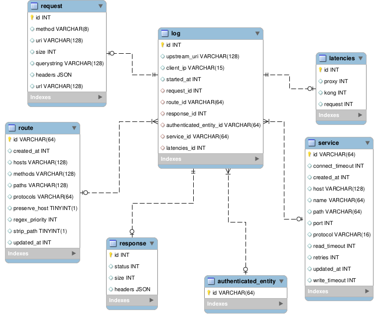

# TesteMelhorEnvio
 Este repositório contém as tarefas desenvolvidas para o teste técnico do processo seletivo de Engenheiro de Dados Jr na Melhor Envio.
 
 Neste README:
    - Organização do projeto
    - Etapas Desenvolvidas
    - Instruções para execução.

## Organização do projeto

    .
    ├── database
    │   ├── db
    │   |   └── create_database.sql
    |   └── Dockerfile 
    ├── notebooks
    |   ├── relatorios
    |       └── ...
    │   ├── Inserção no Banco de Dados.ipynb
    │   ├── Visualização dos dados.ipynb
    |   └── Relatórios.ipynb
    ├── raw_data
    |   └── logs.txt
    ├── docker-compose.yaml
    ├── .gitignore
    └── README.md

- `database`: é utilizado para criar o conatiner Docker onde fica o banco de Dados MySQL.

- `notebooks`: concentra os notebooks de visualização e processamento de dados estão no diretório.

- `relatorios`: contém os relatórios em csv gerados.

- `raw_data`: contém o conjunto de dados original fornecido pelo desafio.

- `img`: diretório com a imagem do modelo do banco de dados.

- `docker-compose`: está na raiz do projeto.

## Etapas desenvolvidas

- __Visualização dos Dados:__ Em um primeiro momento, o arquivo de logs foi analisado em `notebooks/Visualização de Dados.ipynb` para obter uma primeira impressão dos JSONs e servir como base para modelagem do Banco de Dados.

- __Criação do modelo ER do banco:__ Com a ferramenta MySQL Workbench foi desenvolvido um modelo relacional para o banco de dados. A partir do qual, foi gerado o código DDL do banco de dadps (`database/db/create_database.sql`).

- __Containerização do Banco de Dados:__ A próxima etapa foi a criação dos arquivos necessários para execução do banco de dados em ambiente Docker e com acesso ao _localhost_, visto que a aplicação não foi executada em container.

- __Desenvolvimento do Processamento dos Dados:__ Essa etapa diz respeito à persistência dos dados no banco e as análises solicitadas no desafio que estão nos notebooks `Inserção no Banco de Dados` e `Relatórios`, respectivamente.

## Instruções para execução

Este projeto foi desenvolvido em Python3, para sua execução, é necessária a instalação das bibliotecas:

> python3 -m pip install pandas tqdm ipywidgets mysql-connector-python

Além disso, é necessária a instalação do docker e docker-compose no sistema.

Dentro da pasta database:
> sudo docker build -t melhor-db .

Na pasta root:
> docker-compose up